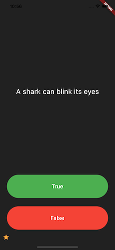
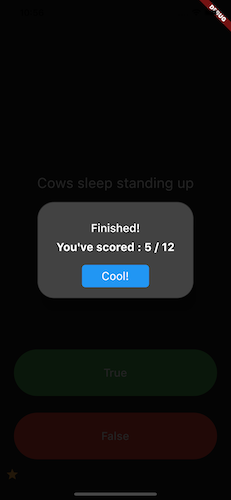

# Trivia App

## Introduction
- A simple quiz app build with flutter
- There are 12 existing questions in the question bank
- Question can be added in ``` lib/quiz_brain.dart ``` by instantiating
```Question(question: 'question here...', answer: true)```

## Installation

```
flutter run 
```

## App Previews



